# Project: Clothes Online shop

## Introduction

**3connguoi Team**

Members:   
- Mai Tuấn Huy
- Bùi Trọng Trí
- Vũ Anh Đức
## Target User

The primary target audience for this project comprises young adults.
- **Age group:** 18-30 years old.
- **Trend:** Suitable for people interested in online shopping and social networks

## User Interface (UI) Requirements
- **Modern and Attractive Design**: Use vibrant colors, high-quality images.
- **Easy Navigation**: Clear menu bar with easily understandable product categories.
- **Product Search and Filtering**: Provide search functionality and filters based on criteria like price, type, size, color, brand.
- **Detailed Product Pages**: Display multi-angle images of products, detailed descriptions, size charts, and user reviews.
- **Consistency:** Use the same font, colors, and icons on all pages.

## Feature Of Users

- **Registration and Login**: Allow users to create accounts and log in using user name and password.
- **Shopping Cart**: Functionality to add products to the cart, view the cart.
- **Order Management**: Users can view purchase history and track order status.
- **User Account Management**: Users can update personal information, manage shipping addresses.

## Feature Of Admin

- **Product Management**: User-friendly system to add, edit, delete products, update prices and inventory levels.
- **Order Management**: Track and process orders, update order status, manage returns.
- **Customer Management**: View and manage customer information, purchase history.

Monitoring and Maintenance: Ensure the website operates stably, with monitoring systems and regular maintenance.

## UI Design

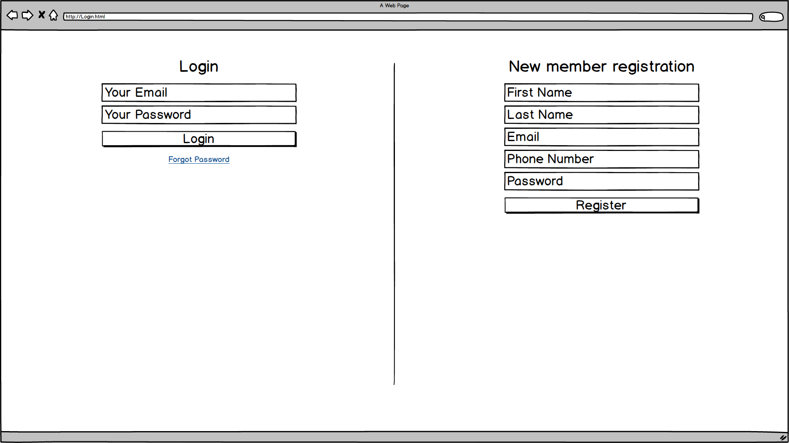
*Login page*

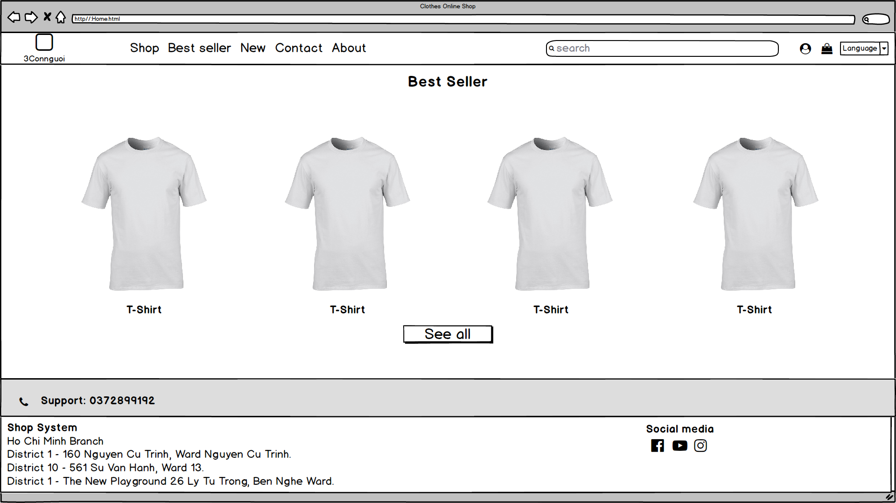
*Home page*

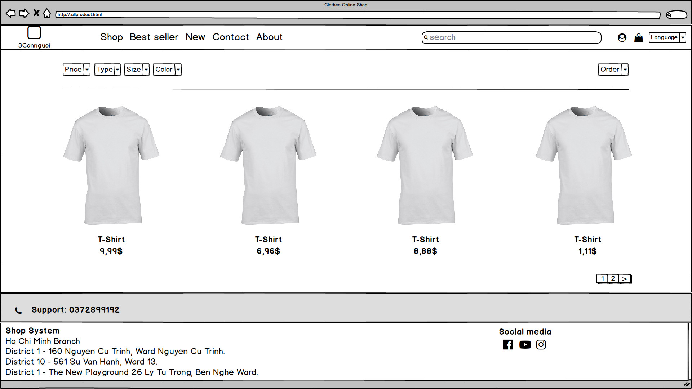
*All product page*

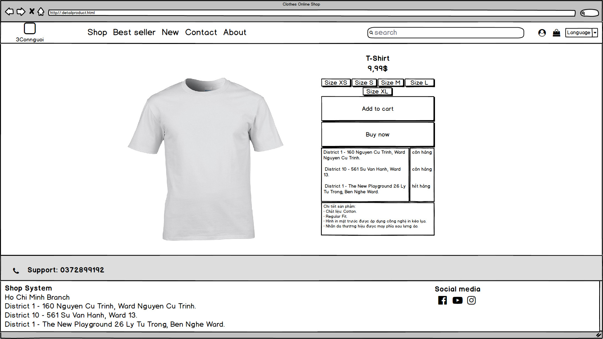
*Product detail page*

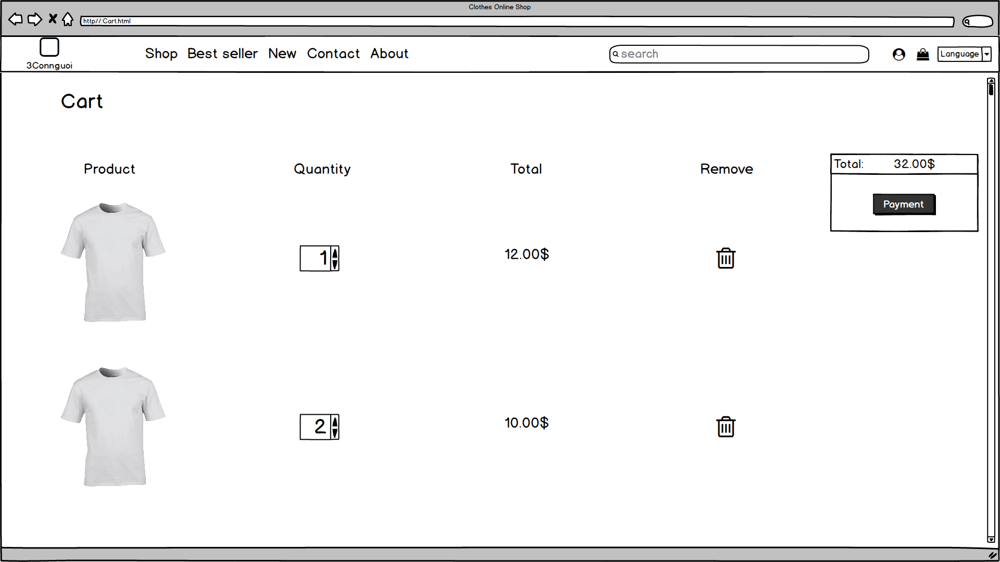
*Cart page*

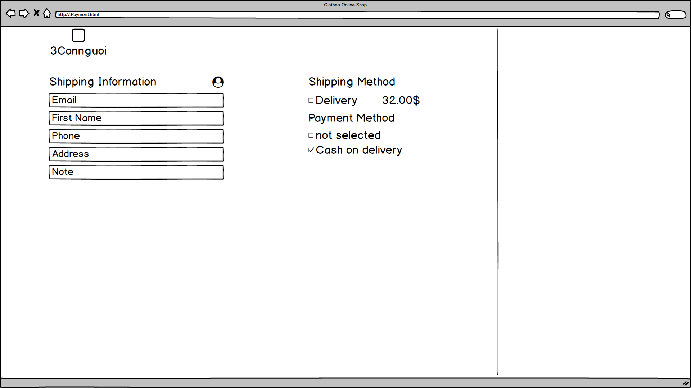
*Payment page*

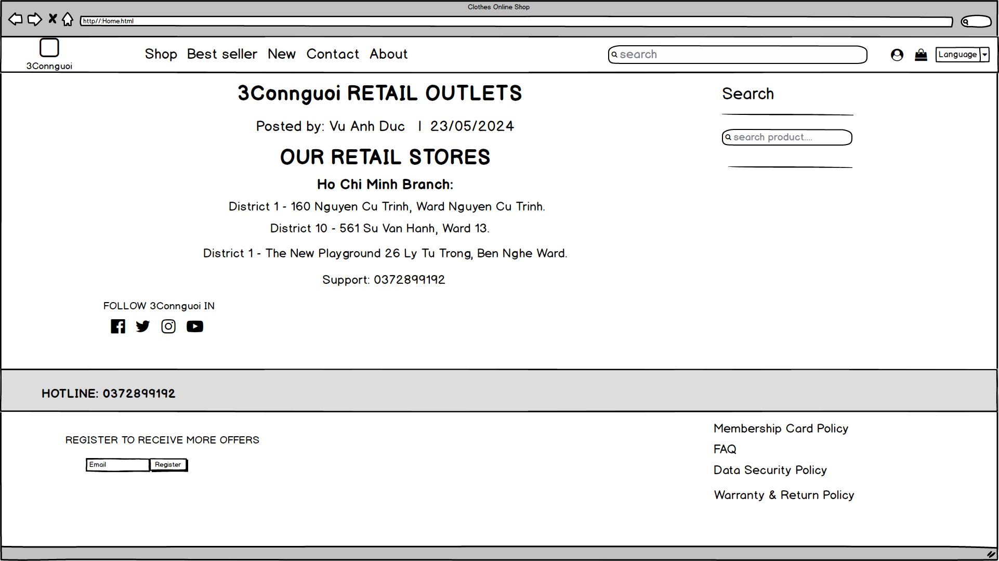
*Contact page*

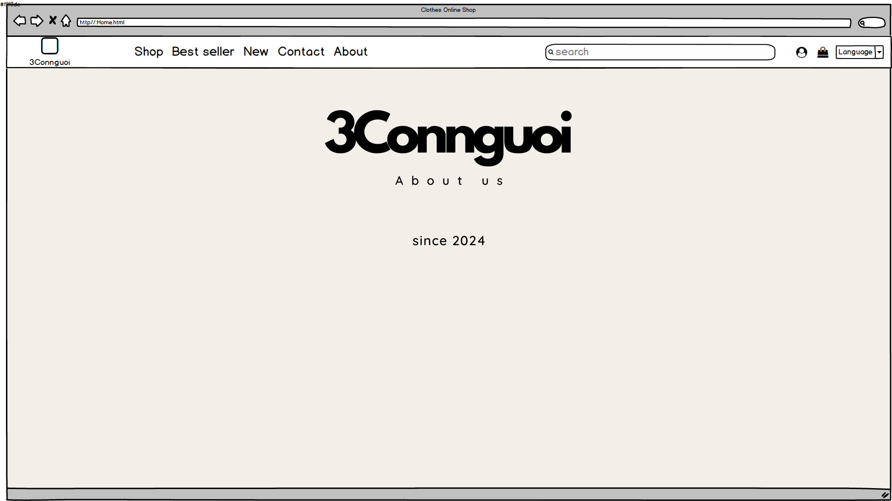
*About page*

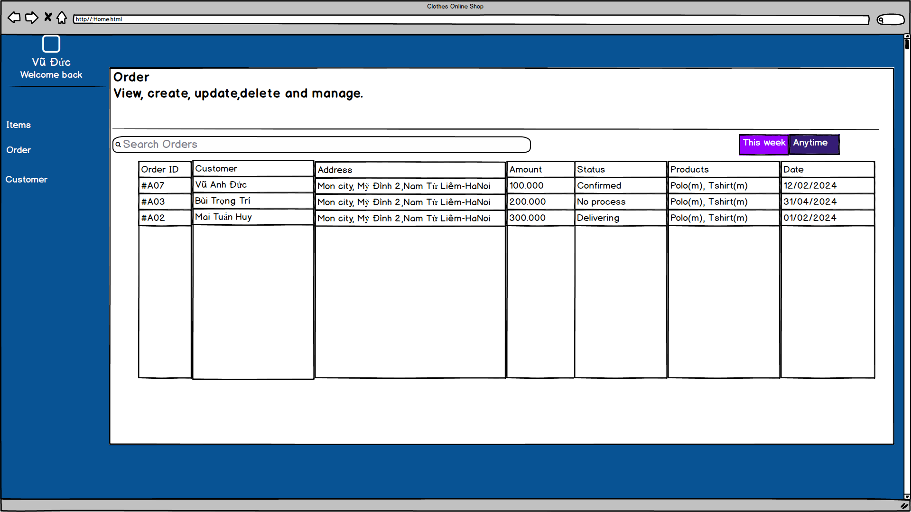
*Order management (admin only)*

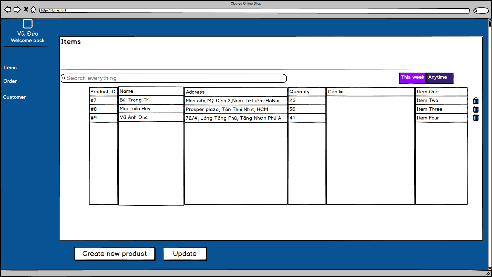
*Items management (admin only)*

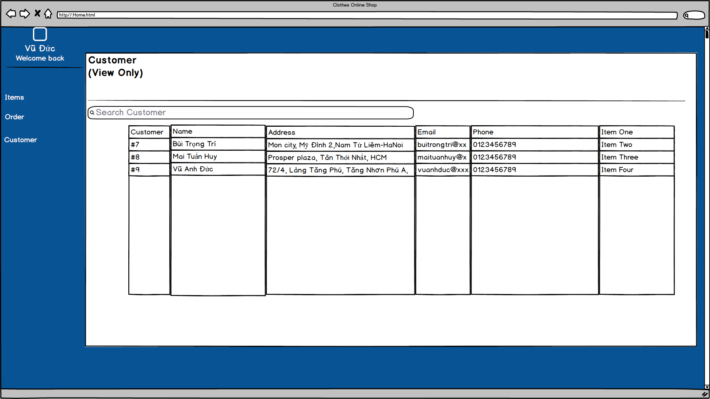
*Customer management (admin only)*

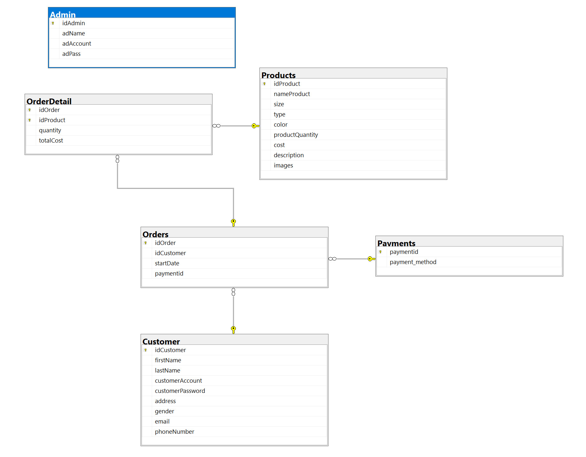 

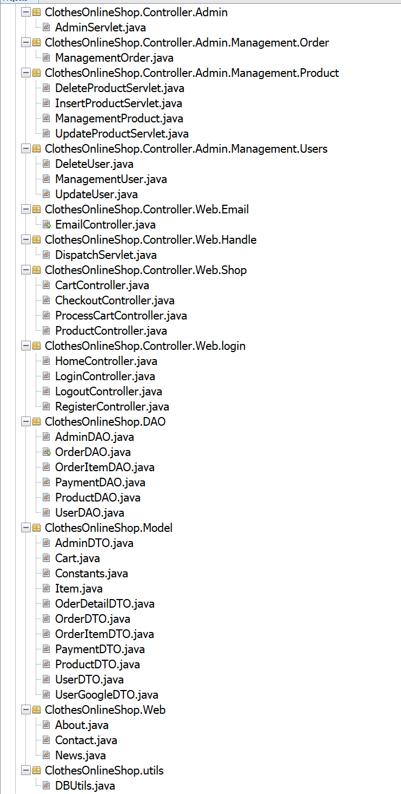 

# Kết luận

## Những gì đã làm được

1. **Chức năng hoàn chỉnh:**
     - Đăng nhập và đăng ký người dùng.
     - Quản lý sản phẩm.
     - Giỏ hàng và thanh toán.
     - Hệ thống quản lý đơn hàng.

2. **Kỹ thuật và công nghệ:**
     - Ngôn ngữ lập trình: Java.
     - Cơ sở dữ liệu: SQL Sever.
     - Quản lý source code.

3. **Giao diện người dùng:**
   - Mô tả các giao diện người dùng đã thiết kế và phát triển.
   - Các yếu tố UX/UI đã được xem xét và cải tiến.

4. **Bảo mật:**
     - Xác thực và phân quyền người dùng.
     - Các biện pháp bảo mật khác.

## Những điều còn hạn chế

1. **Chức năng chưa hoàn chỉnh và cần được cải thiện:**
     - Chức năng tìm kiếm.
     - Hệ thống thông báo (Email, thông báo sau khi hoàn thành hoạt động).
     - Chức năng thêm hình ảnh khi insert product mới.
     - Người dùng chưa thể điều chỉnh profile.
     - Một số chức năng Sort chưa được hoành thành.
     - Người dùng có thể xem lịch sử đơn hàng.
     - Chức năng quên mật khẩu
     - Chưa tách được size của sản phẩm 

2. **Khả năng mở rộng:**
   - Những vấn đề gặp phải khi mở rộng hệ thống:
     - Khả năng mở rộng cơ sở dữ liệu.
     - Quản lý phiên người dùng.

3. **Thiết kế hệ thống:**
   - Clean Code
     - Chưa hoàn thành tốt ở cách đặt tên package, variable, class,..
   - Bố trí các folder
     - Các folder vẫn chưa sắp xếp đồng nhất và nhất quán.
     - Thiết kế 

## Hướng phát triển trong tương lai

1. **Cải thiện hiệu suất và bảo mật:**
   - Các bước sẽ thực hiện để cải thiện hiệu suất và bảo mật.

2. **Phát triển thêm chức năng:**
   - Các chức năng mới sẽ được thêm vào dự án trong tương lai.

3. **Tối ưu giao diện người dùng:**
   - Các cải tiến về giao diện người dùng để tăng trải nghiệm người dùng.

4. **Tích hợp công nghệ mới:**
   - Xem xét và tích hợp các công nghệ mới để cải thiện dự án.

---
## Cảm nghĩ

1. **Những vấn đề đã gặp phải**

 - **Làm việc nhóm**: Thiếu kinh nghiệm về khả năng làm việc nhóm như xảy ra các xung đột về ý tưởng riêng khó thống nhất chung dẫn đến chậm tiến độ (Đã giải quyết).

 - **Tiến độ**: Mặc dù đã bắt đầu thực hiện dự án khá sớm tuy nhiên đó cũng là lý do cả nhóm phải tốn rất nhiều thời gian để sửa. Vì lúc bắt đầu chưa có đủ kiến thức để hiểu cách hoạt động của một trang web là như thế nào nên chỉ chú trọng thời gian để thiết kế FE (Frond-End) nhưng không nghĩ đến việc thuận tiện cho BE (Back-End).

 2. **Những thứ đã học được**

 - **Kiến thức chuyên môn**: Sau khi trãi qua tự làm một dự án trang web bán hàng, thì nhóm đã học được những kiến thức như cách hoạt động của một trang web, cách xây dựng trang web bằng java, thế nào là một trang web e-commerce ...
 
 - **Kinh nghiệm làm việc**: Biết được kế hoạch trước khi bắt đầu một dự án là vô cùng quan trọng vì nó sẽ tiết kiệm rất nhiều thời gian về sau, tương tác và góp ý của các thành viên trong nhóm để tránh xung đột dẫn đến mất thời gian.

*Cảm ơn bạn đã đọc báo cáo này. Chúng tôi mong nhận được sự phản hồi và góp ý để dự án có thể hoàn thiện hơn.*

